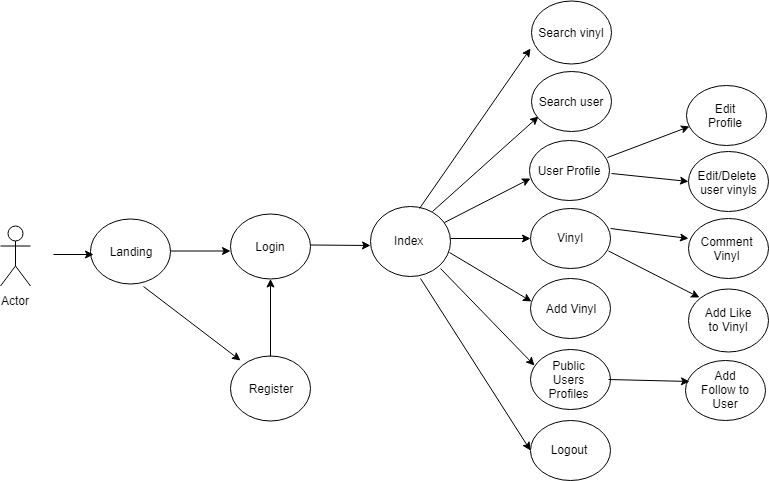
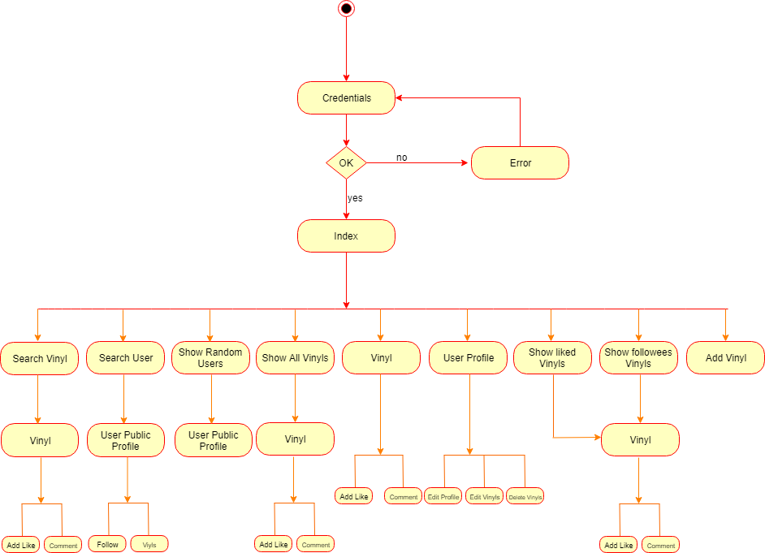

# Vinyls

## Introduction

The application allows its use by registering users. The user can upload their vinyls, follow other users, likes vinyls, add comment to vinyls.

You can also searches for users and serach for vinyls

Each user has a profile page where they can see their data as related vinyls.

The user can have a section where they can edit their personal data, profile photo, edit or delete his vinyls.

## Use cases diagram

## Activity Diagram

The application has one main activity: publish your vinyls, and other cativities like a search users, search vinyls, follow users, likes vinyls, comment vinyls.

## Block diagram
The front end of the application was built using React. The back end is connected to an API that is connected to data module DATA for make change on the Database(CRUD)

## Components Diagram
The application has some react components, the front-end logic, the API back-end, the Api logic connected to the data that interacts with the mongoDB Database.

## Data model

The Application has 3 data models, User, Vinyl and Comment that is embedded in Vinyl.

## Technology Stack

* HTML
* CSS
* Javascript (ES6)
* React
* React Router
* MD Bootstrap React
* APIs
* Node js
* Express
* Mongoose
* MongoDB
* TDD Mocha - Chai

